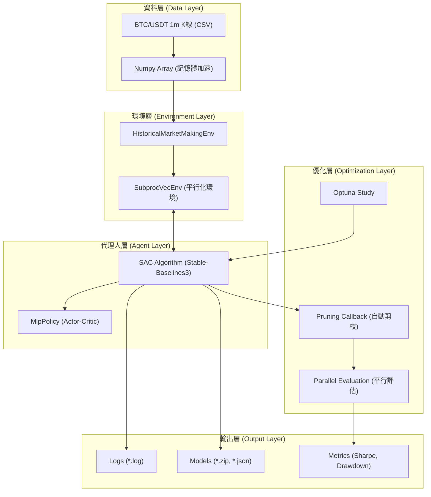

# 做市強化學習 (RL Market Making) 專案

本專案旨在透過強化學習 (Reinforcement Learning, RL) 訓練一個能夠在加密貨幣市場（如 BTC/USDT）中自動進行做市（Market Making）的智能代理人 (Agent)。

專案採用 **Stable-Baselines3 (SAC)** 演算法，結合 **Optuna** 進行超參數優化，並針對 **Apple Silicon (M系列晶片)** 進行了深度效能優化（向量化環境、Numpy 加速、平行運算）。

---

## 🏗️ 系統架構與流程

### 1. 系統架構圖



### 2. 實驗工作流程圖

```mermaid
graph LR
    A[資料準備 fetch_binance_ohlcv] --> B[定義 Configs (yaml)]
    B --> C{超參數搜尋 tune_mm_sac}
    C -->|平行運算| D[Optuna Tuning (多組 Configs)]
    D -->|產出| E[最佳參數 best_params.json]
    E --> F[模型訓練 train_mm_sac]
    F -->|產出| G[訓練好的模型 model.zip]
    G --> H[策略評估 evaluate_policy]
    H --> I[結果分析 analyze_experiments]
```

---

## 🚀 快速開始 (Quick Start)

### 1. 環境安裝

請確保您已安裝 Python 3.10+。

```bash
# 1. 建立虛擬環境
python -m venv .venv
source .venv/bin/activate

# 2. 安裝依賴套件
pip install -r requirements.txt
```

### 2. 資料準備

下載 Binance 的 BTC/USDT 1分鐘 K線資料：

```bash
python scripts/fetch_binance_ohlcv.py --symbol BTC/USDT --timeframe 1m --since "2023-01-01 00:00:00"
```

---

## 🧪 實驗步驟詳解

### 步驟一：定義實驗配置 (Configs)

在 `configs/` 目錄下建立或修改 YAML 設定檔。目前已預設四種場景：

*   `configs/env_baseline.yaml`: 基準策略
*   `configs/env_aggressive_spread.yaml`: 積極縮小價差
*   `configs/env_conservative_inventory.yaml`: 保守庫存控制
*   `configs/env_turnover_penalty.yaml`: 懲罰過度交易

### 步驟二：批次超參數搜尋 (Tuning) 🔥 **核心步驟**

使用我們優化過的平行運算指令，同時對多個 Config 進行 Optuna 調參。這會充分利用您的 CPU 多核效能。

1.  **建立目標清單**：
    ```bash
    cat <<'EOF' > configs/tuning_targets.txt
    configs/env_baseline.yaml
    configs/env_turnover_penalty.yaml
    configs/env_aggressive_spread.yaml
    configs/env_conservative_inventory.yaml
    EOF
    ```

2.  **執行平行 Tuning** (同時跑 2 個實驗，每個實驗內部開 4 個平行環境)：
    ```bash
    # 確保 logs 目錄存在
    mkdir -p logs

    # 啟動平行運算
    i=0; while read cfg; do ((i++)); ( source .venv/bin/activate && cfg_name=$(basename "$cfg" .yaml) && python tune_mm_sac.py --config "$cfg" --n_trials 25 --train_timesteps 80000 --eval_episode_length 600 --eval_episodes 5 --save_best_params --device mps --best_params_path models/${cfg_name}_best_params.json > logs/${cfg_name}_tune.log 2>&1 & echo $! > logs/${cfg_name}_pid.txt ); if (( i % 2 == 0 )); then wait; fi; done < configs/tuning_targets.txt; wait
    ```

3.  **監控進度** (推薦)：
    另開一個 Terminal，即時查看 Log：
    ```bash
    tail -f logs/*.log
    ```
    *當看到 `✅ Tuning Complete` 字樣時，代表該實驗已完成。*

### 步驟三：模型訓練 (Training)

取得最佳參數後 (`models/*_best_params.json`)，開始進行長時間的正式訓練。

```bash
# 範例：訓練 Baseline 策略
python train_mm_sac.py \
    --config configs/env_baseline.yaml \
    --total_timesteps 1000000 \
    --device mps
```
訓練結果會儲存在 `runs/SAC/<timestamp>_<short_name>/`。

### 步驟四：策略評估 (Evaluation)

對訓練好的模型進行嚴格的回測（包含訓練集、驗證集、測試集）。

```bash
python scripts/evaluate_policy.py \
    --config configs/env_baseline.yaml \
    --model_path runs/SAC/您的實驗資料夾/model.zip \
    --episodes 10 \
    --device mps
```

### 步驟五：結果分析 (Analysis)

彙整所有實驗結果，比較 Sharpe Ratio、最大回撤等指標。

```bash
python scripts/analyze_experiments.py --runs_dir runs --sort_by test_sharpe
```

---

## ⚙️ 關鍵參數說明

| 參數 | 說明 | 影響 |
| :--- | :--- | :--- |
| `fee_rate` | 交易手續費率 (預設 0.0004) | 越高則 Agent 越傾向拉大 Spread 或減少交易 |
| `lambda_inv` | 庫存懲罰係數 | 越高則 Agent 越傾向保持零庫存 (Inventory Neutral) |
| `lambda_turnover` | 交易量懲罰係數 | 用於抑制無意義的刷單行為 (Wash Trading) |
| `base_spread` | 基準價差 | 影響掛單的初始寬度 |
| `alpha` | Spread 動態調整係數 | 決定 Agent 能多大程度地改變 Spread |

---

## 🛠️ 效能優化技術細節

本專案針對高頻模擬進行了以下優化：

1.  **Numpy Data Access**: 將環境內的 DataFrame 轉為 Numpy Array，大幅減少 Pandas 索引開銷。
2.  **SubprocVecEnv**: 訓練與評估階段皆採用多進程 (Multi-processing) 平行環境，吞吐量提升 4x 以上。
3.  **Persistent Evaluation**: 評估環境在 Trial 內持久化，消除重複 I/O 與初始化時間。
4.  **Optuna Pruning**: 結合 `TrialPruned` 機制，自動提早終止表現不佳的訓練嘗試。

---

## 📂 目錄結構

```
.
├── configs/                 # 實驗設定檔 (YAML)
├── data/                    # 歷史資料 (CSV)
├── envs/                    # RL 環境定義
├── logs/                    # 執行日誌 (Tuning Logs)
├── models/                  # 最佳參數與模型
├── runs/                    # 訓練產出 (Tensorboard, Checkpoints)
├── scripts/                 # 工具腳本 (下載、評估、分析)
├── train_mm_sac.py          # 訓練主程式
├── tune_mm_sac.py           # 調參主程式 (Optuna)
└── requirements.txt         # 專案依賴
```